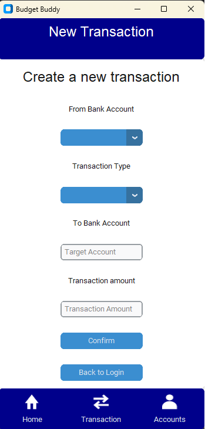

# **Budget Buddy**

## **Introduction**

The aim of this project is to create a financial management tool using a graphical interface and an SQL database (MySQL).
At launch, the app will check if the database already exists on your computer, otherwise it will create it. 
Then you will have to create your account, the application will encrypt your password and your email before storing them in the database.
Inside budget buddy, you can check your accounts, see your past transactions and creates new one's.

- Languages used: Python, SQL
- Libraries used: bcrypt, customtkinter, datetime, decimal, dotenv, mysql.connector, os, PIL, re, string, tkinter

## **Installation**

To install Budget Buddy, follow these steps:

1. Clone this repository: **`git clone https://github.com/olivier-portal/budget_buddy`**, or download the folder as a zip file ("code" button on GitHub)
2. Download the Python language: **https://www.python.org/downloads/**
3. Download MySQL to use our database: **https://dev.mysql.com/downloads/installer/**
4. Install the bcrypt library: **`pip install bcrypt`**
5. Install the customtkinter library: **`pip install customtkinter`**
6. Install the dotenv library: **`pip install python-dotenv`**
7. Install the mysql.connector library: **`pip install mysql-connector-python`**
8. Install the PIL library: **`pip install Pillow`**
9. Navigate to the project directory: **`cd budget_buddy`**

## **Usage**

To use Budget Buddy, follow these steps:

1. Open the computer terminal.
2. Navigate to the project directory: **`cd budget_buddy`**
3. Launch the app.py file: **`py app.py`** or **`python app.py`** or **`python3 app.py`**
4. Play the game.

## **License**

Budget Buddy is released under the Apache-2.0 License. 
See the **[LICENSE](http://www.apache.org/licenses/LICENSE-2.0)** file for details.

## **Authors and Acknowledgment**

Budget Buddy was created by :

- **[Thibault CARON](https://github.com/thibault-caron)**
- **[Lorenzo OTTAVIANI](https://github.com/lorenzo-ottaviani)**
- **[Olivier PORTAL](https://github.com/olivier-portal)**

Thank you to all the contributors for their hard work and dedication to the project.

